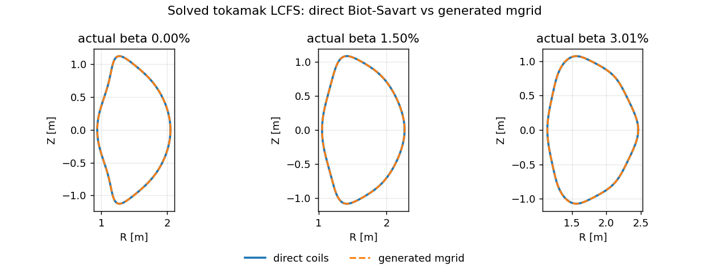
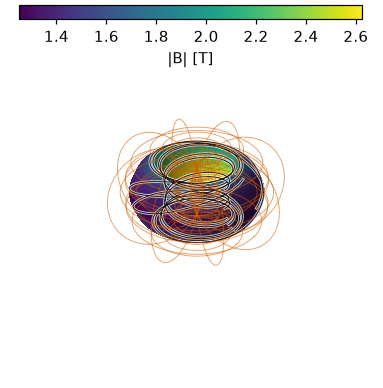

Tutorials
=========

Every tutorial below is a runnable script in the repository's ``examples/``
directory: parameters at the top, no ``main()``, only the public API, and each
is smoke-tested in CI (``tests/test_examples.py``) so the code on this
page always runs.  Copy a script, edit the parameter block, and go.

Run any of them directly::

   python examples/fixed_boundary_run.py

The light scripts finish in a few seconds once JAX has compiled; the
free-boundary and optimization scripts are heavier (see each section).

.. contents:: On this page
   :local:
   :depth: 1

Getting started
---------------

Fixed-boundary run
~~~~~~~~~~~~~~~~~~~

Read an ``&INDATA`` deck, converge the equilibrium on the multigrid ladder with
VMEC2000-format progress printing, and write and plot the ``wout``.  This is the
three-step workflow every new user needs.

.. literalinclude:: ../examples/fixed_boundary_run.py
   :language: python

All diagnostics and the Boozer transform
~~~~~~~~~~~~~~~~~~~~~~~~~~~~~~~~~~~~~~~~~~

vmec-jax ships its plotting and its Boozer transform in the box.  This produces
every ``plot_wout`` figure (flux-surface summary, cross-sections, ``|B|``,
profiles, and a 3D ``|B|`` render with LCFS field lines) and the straight-field-line Boozer ``|B|`` spectrum on the last closed
flux surface — the view used to judge quasisymmetry.

.. literalinclude:: ../examples/plot_and_boozer.py
   :language: python

VMEC++ JSON input
~~~~~~~~~~~~~~~~~

vmec-jax reads both the classic ``&INDATA`` namelist and the VMEC++ JSON schema,
and can write the JSON form — a drop-in for either ecosystem.  This converts a
deck, reads it back, and confirms the two representations describe one
equilibrium.

.. literalinclude:: ../examples/run_from_json.py
   :language: python

Profiles and finite-beta physics
--------------------------------

Profile representations
~~~~~~~~~~~~~~~~~~~~~~~~

Pressure and rotational transform (or current) can be given as polynomial
coefficients (``power_series``) or spline knots (``cubic_spline``).  This solves
the same equilibrium both ways and shows they agree, then points to the
``NCURR=0`` vs ``NCURR=1`` (prescribed iota vs prescribed current) switch.

.. literalinclude:: ../examples/profiles_power_and_spline.py
   :language: python

Finite-beta pressure scan
~~~~~~~~~~~~~~~~~~~~~~~~~~

Ramp the pressure and read three diagnostics straight from the wout: the
volume-averaged beta, the Shafranov shift (outward motion of the magnetic axis),
and the Mercier ``DMerc`` interchange-stability profile.  Each step is
hot-restarted from the previous equilibrium.

.. literalinclude:: ../examples/finite_beta_scan.py
   :language: python

Performance: hot restart
------------------------

Seed each point of a parameter scan from the previous converged state.  Warm
restarts converge in about one iteration instead of hundreds, and because
vmec-jax caches one compiled executable per solver structure, the whole scan
recompiles nothing.

.. literalinclude:: ../examples/hot_restart_scan.py
   :language: python

Differentiation
---------------

Fixed-boundary gradients (implicit differentiation)
~~~~~~~~~~~~~~~~~~~~~~~~~~~~~~~~~~~~~~~~~~~~~~~~~~~~~

Differentiate a *converged* equilibrium.  ``jax.grad`` returns exact derivatives
of wout scalars (aspect ratio, magnetic energy, ...) with respect to the
boundary Fourier coefficients and profile parameters, computed by the implicit
function theorem — one adjoint solve, O(1) memory, no finite-difference step to
tune.  The script checks the adjoint gradient against central differences.

.. literalinclude:: ../examples/take_gradients.py
   :language: python

Free-boundary gradients (virtual casing)
~~~~~~~~~~~~~~~~~~~~~~~~~~~~~~~~~~~~~~~~~~

The differentiable complement for free boundary: the plasma–vacuum interface
mismatch is written as a smooth objective and differentiated with respect to the
coil currents (``extcur``) and coil Fourier shape, finite-difference-validated.

.. literalinclude:: ../examples/take_free_boundary_gradients.py
   :language: python

Free boundary
-------------

From an mgrid file
~~~~~~~~~~~~~~~~~~

Prescribe the *coils* instead of the boundary: the coil currents (``EXTCUR``)
and their tabulated vacuum field (an mgrid file) drive a NESTOR vacuum solve, and
VMEC finds the plasma boundary that balances against it.  The last closed flux
surface is an output, not an input.

.. literalinclude:: ../examples/free_boundary_mgrid.py
   :language: python

Direct coils and their generated mgrid
~~~~~~~~~~~~~~~~~~~~~~~~~~~~~~~~~~~~~~

``free_boundary_tokamak_coils.py`` constructs circular TF/PF coils, generates
a VMEC2000-compatible mgrid from those exact filaments, and solves both
free-boundary providers at actual beta 0, 1.496%, and 3.009%. The maximum LCFS
coefficient difference is ``6.31e-4``. Both WOUT sets and the parity CSV are
written alongside the standard 3D, ``|B|``, surface, profile, and Mercier plots.

.. literalinclude:: ../examples/free_boundary_tokamak_coils.py
   :language: python

Free-boundary beta scan
~~~~~~~~~~~~~~~~~~~~~~~~

Ramp the pressure of the free-boundary case at fixed coil currents; the boundary
is re-solved by NESTOR at every step as the plasma pushes outward against the
external field. Each converged state seeds the next pressure point, including
its solved LCFS.

.. literalinclude:: ../examples/free_boundary_beta_scan.py
   :language: python

Optimization
------------

The ``examples/optimization/`` gallery drives a circular torus to precise
quasisymmetric (QA, QH, QP) and quasi-isodynamic (QI) configurations with
gradient-based least squares — user-authored ``(function, target, weight)``
objective terms with implicit-differentiation gradients
(``jac="implicit"``).  See :doc:`objectives` for the full objective library
(quasisymmetry and omnigenity residuals, Redl bootstrap, ballooning
stability, turbulence proxies, scalar targets) and :doc:`optimization` for
the differentiation machinery and the measured campaign timings.

Single-call ESS optimization (recommended)
~~~~~~~~~~~~~~~~~~~~~~~~~~~~~~~~~~~~~~~~~~

The recommended pattern is **one** ``least_squares`` call with *all* the
boundary harmonics released at once and Exponential Spectral Scaling
(``use_ess=True``) ordering them through the trust region — no
``max_mode`` continuation loop.  Measured: precise QA (QS 7.2e-6) in
14.5 minutes on a CPU.

.. literalinclude:: ../examples/optimization/QA_optimization_ess.py
   :language: python

``QI_optimization_ess.py`` is the quasi-isodynamic analogue: the traceable
Goodman constructed-QI residual (:class:`~vmec_jax.core.omnigenity.QIResidual`)
plus practical targets, one call at ``max_mode = 6`` (25x residual
reduction in 17.3 minutes).

Staged ``max_mode`` continuation
~~~~~~~~~~~~~~~~~~~~~~~~~~~~~~~~

The classic ladder — one least-squares stage per ``max_mode``, each seeded
with the previous stage's boundary — remains available and is what
``QA_optimization.py``, ``QH_optimization.py``, ``QP_optimization.py``, and
``QI_optimization.py`` run (QI with a quasi-poloidal basin stage first).
It reaches the same precision class as the single-call pattern at roughly
twice the wall time; the scripts stay side by side so the comparison is
reproducible.

.. literalinclude:: ../examples/optimization/QA_optimization.py
   :language: python

These are the heaviest examples (hundreds to thousands of solves) and are
exercised in the nightly CI run.
